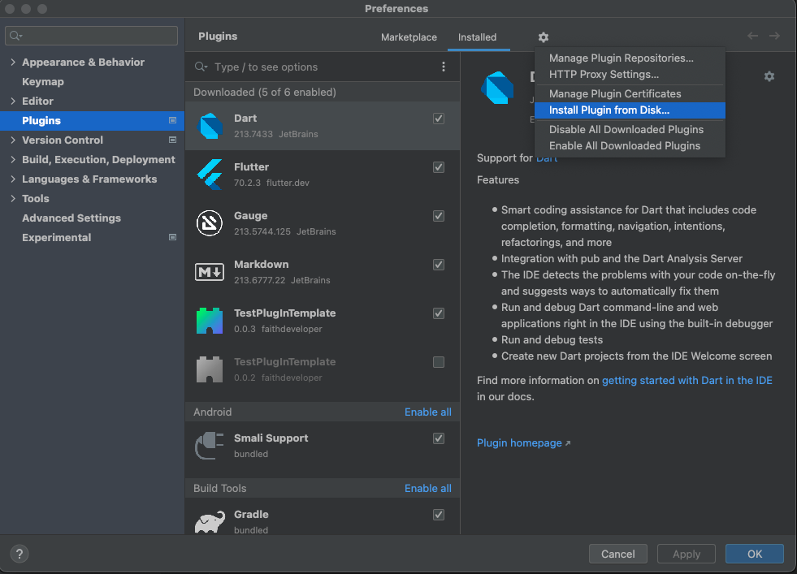
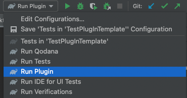
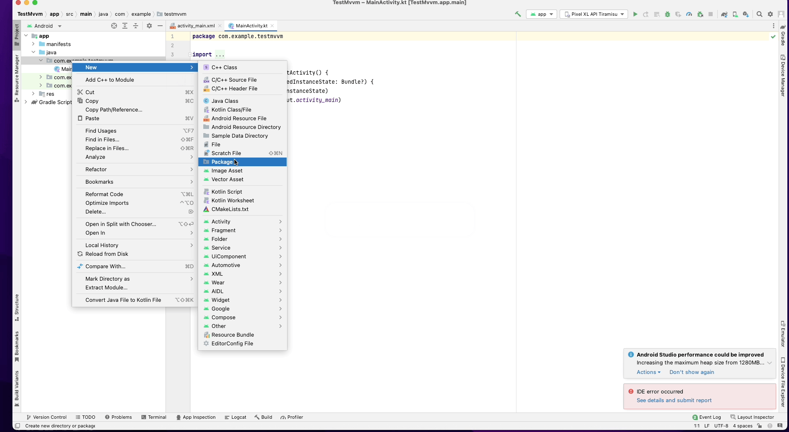

# Plugin Install

Gradle Run Plugin을 실행하면 Build/libs 안에 jar 파일을 볼 수 있습니다.

Gradle Run Plugin 하는 방법은 여러방법이 있는데 쉽게 할 수 있는 방법은 Android Studio의 Build 를 `Run Plugin` 로 설정하면됩니다. 

생성된 jar 파일을 Android Studio Plugins에서 세팅하면 지금 만든 Template을 사용할 수 있습니다.

# PlugIn Example
